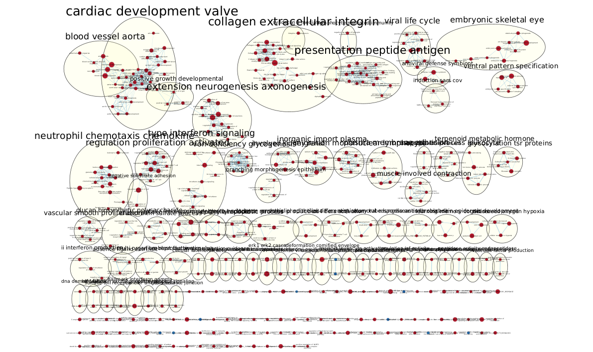

# Introduction

This assignment is a continuation of A2, where differential expression and preliminary thresholded over-representation analysis was done on the normalized data from A1. The data set that was selected, entitled [Small Molecule Targets TMED9 and Promotes Lysosomal Degradation to Reverse Proteinopathy](https://doi.org/10.1016/j.cell.2019.07.002) [@dvela2019small], shows that the toxic accumulation in TMED9-enriched vesicles of mutant MUC1-fs is cleared from mice and patient kidneys by BRD4780 binding to TMED9, releasing MUC1-fs. In this assignment A3, we do pathway and network analysis from the ranked output file of A2--ranked genes according to differential expression. We do it with GSEA, the Gene Set Enrichment Analysis tool [@doi:10.1073/pnas.0506580102], for non-thresholded analysis. Then once those results are available, we visualize them in Cytoscape [@shannon2003cytoscape]. 


# Non-thresholded GSEA

The methods that were used were very much like the homework assignment on GSEA. The Java applet was used because there are problems associated with running GSEA in R. By doing it with the applet, we keep the A3 method consistent with the homework. We went with GSEAPreranked because our list was already ranked in A2. The same settings as the homework were used.

## Loading of libraries

```{r}
#install required R and bioconductor packages
tryCatch(expr = { library("RCurl")}, 
         error = function(e) {  install.packages("RCurl")}, 
         finally = library("RCurl"))

#use library
#make sure biocManager is installed
tryCatch(expr = { library("BiocManager")}, 
         error = function(e) { 
           install.packages("BiocManager")}, 
         finally = library("BiocManager"))
tryCatch(expr = { library("ggplot2")}, 
         error = function(e) { install.packages("ggplot2")}, 
         finally = library("ggplot2"))
#use easy cyRest library to communicate with cytoscape.
tryCatch(expr = { library("RCy3")}, 
         error = function(e) { BiocManager::install("RCy3")}, 
         finally = library("RCy3"))
```

```{r}
library(kableExtra)
```

## Running GSEA

We obtain the ranked list of genes from our A2 output. That is the only set we process for A3 from A2.

```{r}
a2_ranked <- "a2_output/ranked_genelist.rnk"
if(file.exists(a2_ranked)){
  a2_ranked_genelist <- read.table(file=file.path(getwd(), a2_ranked),
                          header = FALSE, sep = "\t", stringsAsFactors = FALSE, check.names = FALSE)
}
```

```{r}
colnames(a2_ranked_genelist) <- c("Gene", "Rank")
kable(a2_ranked_genelist[1:10,1:2],type="html",row.names = FALSE, digits=7, 
      table.attr = "style='width:100%;'", 
      caption = "Figure 1. Ranked gene list from A2 output (first 10 rows shown).") %>%
  kable_styling()
```

Then we run GSEAPreranked 4.3.2 on Linux with the following parameters:

* Gene sets database: Human_GOBP_AllPathways_no_GO_iea_March_02_2023_symbol.gmt
* Number of permutations: 1000
* Collapse/Remap to gene symbols: No_Collapse
* Max size: 200
* Min size: 15

## Summary of results

### Upregulation

* 5107 / 5176 gene sets are upregulated in phenotype na_pos
* 1576 gene sets are significant at FDR < 25%
* 761 gene sets are significantly enriched at nominal pvalue < 1%
* 1406 gene sets are significantly enriched at nominal pvalue < 5%

```{r}
gsea_upreg <- read.delim("gsea_output/gsea_report_for_na_pos_1680893490867.tsv")
gsea_downreg <- read.delim("gsea_output/gsea_report_for_na_neg_1680893490867.tsv")
```

```{r}
gsea_upreg <- gsea_upreg[, !(names(gsea_upreg) %in% c("NOM.p.val", "RANK.AT.MAX", "LEADING.EDGE",
                                                      "GS.br..follow.link.to.MSigDB", "GS.DETAILS",
                                                      "FWER.p.val", "X"))]

kable(head(gsea_upreg, n = 10), type="html", row.names = FALSE,
      table.attr = "style='width:30%;'", 
      caption = "Figure 2. Upregulated gene sets from GSEA (first 10 rows shown).") %>%
  kable_styling()
```

### Downregulation

* 69 / 5176 gene sets are upregulated in phenotype na_neg (downregulation)
* 14 gene sets are significantly enriched at FDR < 25%
* 12 gene sets are significantly enriched at nominal pvalue < 1%
* 12 gene sets are significantly enriched at nominal pvalue < 5%

```{r}
gsea_downreg <- gsea_downreg[, !(names(gsea_downreg) %in% c("NOM.p.val", "RANK.AT.MAX", "LEADING.EDGE",
                                                        "GS.br..follow.link.to.MSigDB", "GS.DETAILS",
                                                        "FWER.p.val", "X", "NES", "FDR.q.val"))]

kable(head(gsea_downreg, n = 10), type="html", row.names = FALSE,
      table.attr = "style='width:100%;'", 
      caption = "Figure 2. Downregulated gene sets from GSEA (first 10 rows shown).") %>%
  kable_styling()
```

## Comparison to results from A2

It would seem as if there are a similar number of upregulated genes, 4847 from the A2 thresholded list compared to 5107 from the non-thresholded GSEA. However, 4646 downregulated genes from the A2 thresholded list are a stark difference from the 69 from the non-thresholded GSEA. Despite that, the results are to be compared qualitatively. Thresholded over-representation analysis is done to highlight dominant genes in the top set of genes. GSEA's annotations include some of the same sources as g:Profiler [@gprofiler], which we put the upregulated genes from A2 in, such as Reactome, GO:BP, and WikiPathways. However, the magnitudes of the values are quite different between gene sets from the same source of thresholded ORA and non-thresholded GSEA.

```{r}
kable(gsea_upreg[with(gsea_upreg,  grepl("NEGATIVE REGULATION OF VIRAL GENOME", NAME)
                        |  grepl("RESPONSE TO INTERFERON-ALPHA", NAME)), ],
      type="html", row.names = FALSE,
      table.attr = "style='width:100%;'", 
      caption = "Figure 3. Comparison of two GO:BP genes from GSEA and below from g:Profiler.") %>%
  kable_styling()
```


In fact this is because the methods differ so it is not a straight forward comparison.

# Visualization in Cytoscape

Using the results from the non-thresholded GSEA, we visualize them in Cytoscape by importing the generated .tsv files.

## Enrichment map

We create an enrichment map using the EnrichmentMap app [@Merico2010-yd] version 3.3.5 in Cytoscape version 3.9.1. The resulting graph looks like this:


There are 455 nodes and 765 edges. Along with the .tsv files, the GMT *Human_GOBP_AllPathways_no_GO_iea_March_02_2023_symbol.gmt* was used from Bader Lab. NES was set to positive because missing NES values from the downregulated genes are a bug in some versions of GSEA (otherwise they would be set to 1.0). Other parameters were set to their defaults.

Number of Nodes (gene-set filtering)

* FDR q-value cutoff: 0.1
* p-value cutoff: 1.0
* NES (GSEA only): positive

Number of Edges (gene-set similarity filtering)

* Data Set Edges: Automatic
* Cutoff: 0.375
* Metric: Jaccard+Overlap Combined (evenly)

## Network annotation

The AutoAnnotate app part of the EnrichmentMap Pipeline Collection [@Reimand2019-le] was used for annotation. The used Cluster Options are as follows:

* Use clusterMaker App
* Cluster algorithm: MCL Cluster
* Edge weight column: similarity_coefficient

Label Options set to their defaults.




## Collapsed theme network


The major theme present in this analysis is cardiac activity, consisting of four connected nodes of the summary network. They not related to the subject of the paper. There is another theme: a pathway in the network. Shown as Figure 7, it'll be explained in the interpretation section. It is likely what's novel to the paper.


# Interpretation and detailed view of results

The upregulated *MUC1* gene that in the paper is toxic with the mutant *MUC1* is found in the NEGATIVE REGULATION OF CELL ADHESION gene set within the NEGATIVE SUBSTRATE ADHESION cluster, immediately connected to gene sets in the REGULATION PROLIFERATION ACTIVATED cluster. Within it the connections are to NEGATIVE REGULATION OF LYMPHOCYTE PROLIFERATION and NEGATIVE REGULATION OF T CELL PROLIFERATION. One can see how upregulated *MUC1* is related to toxicity if it negatively regulates the proliferation of lymphocytes and T-cells.


The upregulated *MUC1* gene is also found in the GLYCOSYLATION TSR PROTEINS cluster. Specifically it is in gene sets of diseases.


Thresholded over-representation analysis is done to highlight dominant genes in the top set of genes. With this GSEA and Cytoscape method, it is easy to see the pathways of related gene sets in a way that was not possible in A2. We were not able to find anything conclusive about *MUC1* in A2. However, we were able to do so in A3.

The paper entitled "Soluble MUC1 secreted by human epithelial cancer cells mediates immune suppression by blocking T-cell activation" [@Chan1999-ed] supports these results. It shows that the upregulated *MUC1* from cancer cells' secretion blocks T-cell activation, and it is such in the pathway discussed.

I chose the pathway in Figure 7 to investigate in more detail in Figure 8. I chose it because of the relevance it has to the paper.

```{r}
gsea_upreg <- read.delim("gsea_output/gsea_report_for_na_pos_1680893490867.tsv")
gsea_upreg <- gsea_upreg[, !(names(gsea_upreg) %in% c("RANK.AT.MAX", "LEADING.EDGE",
                                                      "GS.br..follow.link.to.MSigDB", "GS.DETAILS",
                                                      "FWER.p.val", "X"))]

# Obtaining the sources of the pathway gene sets.
kable(gsea_upreg[with(gsea_upreg,  grepl("NEGATIVE REGULATION OF CELL ADHESION", NAME)
                        |  grepl("NEGATIVE REGULATION OF T CELL PROLIFERATION", NAME)
                        |  grepl("NEGATIVE REGULATION OF LYMPHOCYTE PROLIFERATION", NAME)), ],
      type="html", row.names = FALSE,
      table.attr = "style='width:100%;'", 
      caption = "Figure 10. GO:BP gene sets relevant to our pathway and below from g:Profiler.") %>%
  kable_styling()
```


Gene sets' log values of the other two couldn't be found in g:Profiler. We can see in Figure 10 that there is statistical significance of those gene sets, but we can not see how they affect our model.


# References